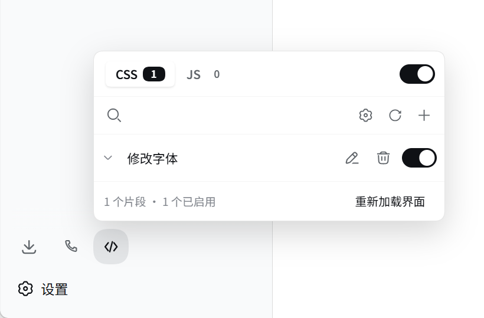
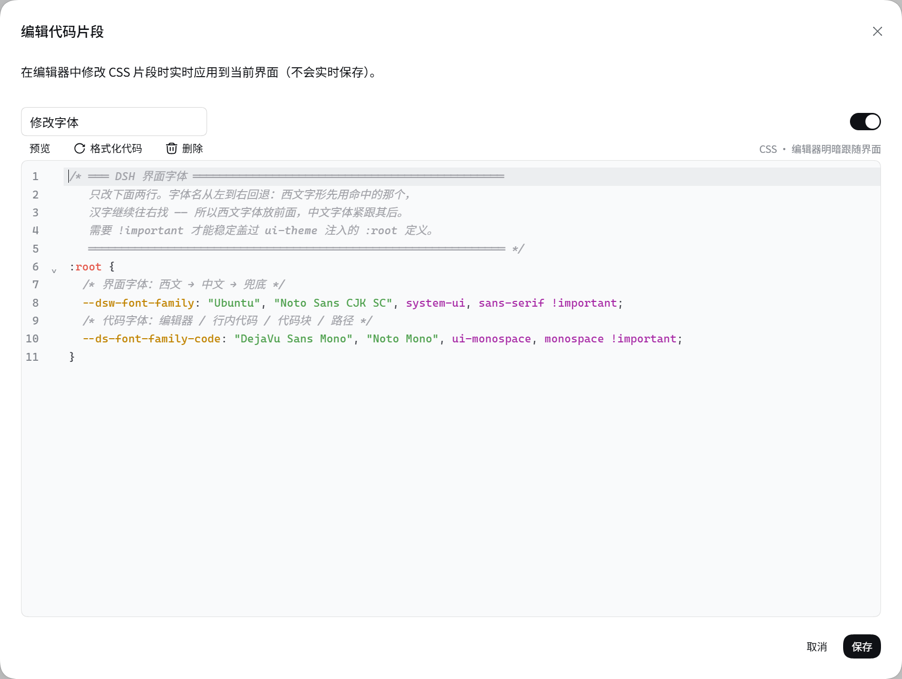

# dsh-snippets

CSS and JS code snippets for the [DeepSeek Harness](https://github.com/deepseek-ai/deepseek-harness) web GUI.

A full-width quick toggle in the sidebar footer, aligned column for column with
the **Settings** row above it (a `</>` glyph on the left, the name on the right),
opens a manager panel, and the plugin's page in the **Plugins** manager carries a
collapsible settings card with the full set of preferences. Enabled **CSS** is
injected into the page immediately; enabled **JS** runs after the page loads.

> Inspired by [TCOTC/snippets](https://github.com/TCOTC/snippets), the SiYuan
> note-taking app's snippet manager, and adapted to the DSH plugin contract.

[简体中文](./README.zh-CN.md)

## Screenshots

The quick toggle fills a whole row of the sidebar footer, exactly like Settings, and opens the manager panel:



The editor is CodeMirror 6 — line numbers, CSS/JS highlighting, search and replace — sized to the viewport, with live CSS preview:



## Features

**Managing snippets**

- CSS / JS tabs with live counts, one master switch per type, and search across
  titles, code, or both
- Its own settings card on the plugin's page in the **Plugins** manager, opened
  from a chevron and keyed by the package name
- Add, edit, duplicate, delete, enable/disable, and drag to reorder
- Ten sort orders (custom, enabled-first, title A→Z / natural, oldest/newest)
- Per-row edit / duplicate / delete buttons, each individually hideable
- One-click **Reload the interface** for changes only a reload can apply

**Editing**

- CodeMirror 6: line numbers, CSS/JS syntax highlighting, bracket matching, fold
  gutter, search & replace, history
- Configurable indent unit, font size and soft wrap; the theme follows the app,
  including dark mode
- **Live CSS preview** — see the page change while you type, without saving
- The editor dialog sizes itself to the viewport (up to 1040×760) instead of the
  shell's 380px form card, and the code area absorbs the leftover height, so a
  long snippet scrolls inside the card rather than pushing the dialog past the
  window edge
- Best-effort re-indent that only ever rewrites leading whitespace
- Content guards: CSS containing `</style` or `<script` is refused, and JS is
  parsed before it is saved

**Beyond the browser**

- **Local folder watch** — mirror a folder of `.css` / `.js` files into the
  snippet library, continuously or once at startup
- **Import / export** the whole library as JSON, with an automatic backup before
  a destructive import
- **GitHub Gist sync** — publish a selection, or import with *merge update*,
  *mirror overwrite* or *add only*, previewing the per-file diff first

## Install

Requires DeepSeek Harness `0.1.7-rc.1` or newer: 0.1.7 rewrote the settings line,
and earlier harnesses expose neither `configForms` nor an entry-scoped settings
API for a plugin to bind to.

```bash
dsh plugin --profile web add github:zhang24xiao/dsh-snippets
```

Then restart the web GUI. From a checkout:

```bash
git clone git@github.com:zhang24xiao/dsh-snippets.git
dsh plugin --profile web add link:$PWD/dsh-snippets
```

The built `lib/index.js` and `client/client.js` are committed, so a
`github:` install needs no build step.

## Where things live

| Surface | DSH seat |
| --- | --- |
| Quick toggle + manager panel | `sidebar.footer.action`, a full-width row: `</>` glyph + the name |
| Settings | `plugins.bundle.config`, the collapsible card on this package's page in the Plugins manager |
| Editors, confirmations, toasts | `shell.overlay` |
| Snippet library | the `dsh-snippets` namespace of the profile's settings document |
| Backups, Gist token, watcher memory | `$DSH_HOME/dsh-snippets/` |

## Layout notes

- The sidebar-foot trigger follows the column width in two shapes, and both are
  measured against the **Settings** row:
  - **wide** is one whole row: 42px tall, `padding: 0 10px 0 8px`, an 8px gap
    between glyph and label, radius 12, 14px/22px type — the Settings row's own
    numbers, field for field, which is what lands both rows' glyphs and labels
    on one column;
  - **rail** is a bare `36×36` circle with `margin: 8px 0 10px`, matching the
    circle in Settings' own rail row.

  The wide row's label carries the name; the tooltip still reports the total
  and enabled counts.
- That 4px side bleed in the wide state (`width: calc(100% + 4px);
  margin: 4px -2px`) is copied from the Settings row's own container. Without
  it this row sits 2px to the right of Settings — that 2px *is* the alignment.
- The sidebar shell lays the foot out as a column but keeps
  `sidebar.footer.action` a **row** even when the column is collapsed to the
  56px rail. With one action that is invisible; with two, the icons land side by
  side and overflow. This plugin therefore injects one narrowly scoped rule that
  makes the collapsed row a column again — and lets the wide row **wrap**,
  because the seat is shared: a full-width entry (this plugin, or `dsh-mobile`'s
  phone entry) would otherwise push its neighbour past the sidebar edge, where
  the shell's overflow hides it:

  ```css
  html [class*='_footerActions']             { gap: 6px; flex-wrap: wrap; }
  html [class*='_collapsed'] [class*='_footerActions'] { flex-direction: column; gap: 4px; … }
  ```

  The attribute-substring selectors are deliberate: if the shell's class hashes
  change, the rule simply stops matching and the rail falls back to the shipped
  layout instead of breaking.

## How CSS and JS take effect

- Each enabled **CSS** snippet becomes one `<style data-dsh-snippet="<id>">`
  element in `<head>`. Toggling one adds or removes exactly that element, so CSS
  applies and reverts instantly with no reload.
- Each enabled **JS** snippet is compiled with `new Function` and called once per
  page load. **There is no sandbox and no undo** — this is deliberately the same
  trust model as pasting the code into the browser console, which is the point of
  the feature. Disabling, editing or removing a JS snippet therefore reports
  that a reload is required, and `autoReloadAfterJsEdit` can do it for you.
- `window.__dshSnippets` exposes `{ version, log, reload }` for snippets that
  want an entry point.
- Unloading the plugin removes every `<style>` it injected. Executed JS is not
  undone; it cannot be.

## Security notes

- Snippet data travels **only** over the official settings wire. The plugin adds
  no browser-writable snippet endpoint, so on a LAN or tunneled deployment an
  unpaired visitor cannot reach a route that would inject code into a page.
- The plugin's own endpoints (`/snippets/api/*`) do the three things a browser
  cannot: read the watched folder, call GitHub, and open the backups directory.
  They answer **loopback requests only**; over a LAN or tunnel those sections
  disable themselves and say so.
- The GitHub token is stored on the host at `$DSH_HOME/dsh-snippets/gist-token.json`
  with mode `0600`. It never enters the settings document, never reaches the
  browser, and the UI only ever learns whether one is configured.

## Differences from TCOTC/snippets

Three settings describe SiYuan features that DSH does not have:

| SiYuan | DSH |
| --- | --- |
| Snippet "publish service" switches | Removed — DSH has no publish concept |
| "Open the native snippet window" | Replaced by "Open the backups folder" |
| Watched folder: relative paths only | Absolute paths and `~` are supported (the DSH host is a plain Node process) |

## Development

```bash
pnpm install
pnpm run check     # typecheck, build, and all four test suites
pnpm run watch     # rebuild on change
```

`npm run test` runs four suites:

- `test/host.test.mjs` — plugin mounting (the exported `Config` schema, the
  volatile fields it resolves to, the settings presentation owner, the routes,
  and the two config-commit signals), re-arming of the folder watcher when the
  watch settings change, the loopback fence on every route, backups, the folder
  mirror (including id stability across scans), the Gist import plan, and the
  content guards.
- `test/cordis.test.mjs` — mounts the built host bundle through the real
  `@deepseek-ai/cordis` and replays the plugin loader's own volatile commit, so
  that `Context.filter` arbitrates delivery for real. It pins the two things a
  fake context cannot: the loader's filtered `loader/volatile-update` reaches
  this plugin while a listener on `root` does not (the negative control), and
  `settings/document-updated` is what re-arms the watcher, gated by namespace.
- `test/client.test.mjs` — loads the built `client/client.js` through
  `window.__ModuleLoader__.load` in jsdom and drives the runtime: an enabled CSS
  snippet produces exactly one `<style>`, an enabled JS snippet runs exactly
  once, disabling removes only that element, the type master switch gates
  injection, and teardown leaves nothing behind. It then server-renders all
  three registered seats, so a broken render path fails here rather than in the
  GUI.
- `test/client-modules.test.mjs` — hands this package's manifest to the real
  `@deepseek-ai/dsh-client-modules` registry through a scratch
  `node_modules/dsh-snippets` symlink, and asserts the whole browser-half
  contract: the composed boot graph carries `dsh-snippets`, `clientPath()`
  resolves to this package's `client/client.js`, `dsh.client.inject` survives
  manifest parsing in order, and the advertised revision serves the real bundle
  over `/plugins` (while a stale revision 404s). It also proves the graph is
  driven by the Loader row rather than by the package merely being resolvable.

## License

MIT
