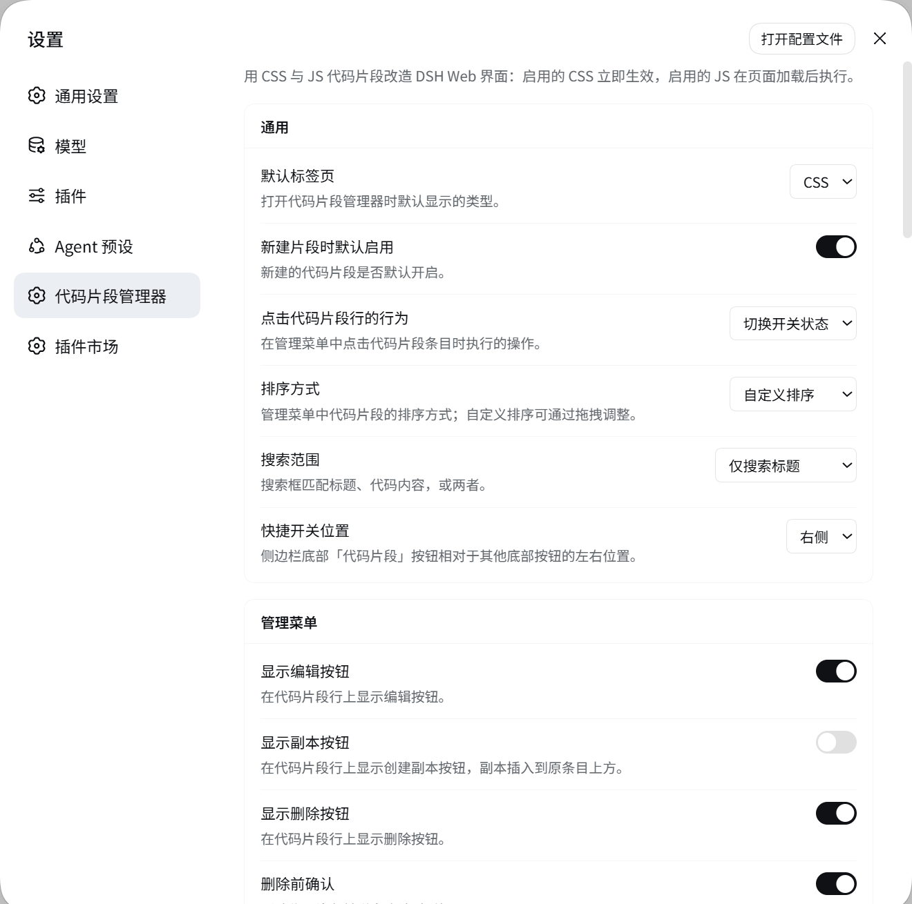

# dsh-snippets

给 [DeepSeek Harness](https://github.com/deepseek-ai/deepseek-harness) Web 界面用的 CSS / JS 代码片段管理器。

侧边栏底部、紧挨**设置**的位置有一个快捷开关（与 `@linxin666/dsh-remote-web-ui` 的手机图标同一排），点开就是管理面板；
**设置 → 代码片段管理器** 是一个独立的设置页，包含全部偏好项。启用的 **CSS** 会立即注入到页面，启用的 **JS** 会在页面加载后执行。

> 参考思源笔记的 [TCOTC/snippets](https://github.com/TCOTC/snippets)，按 DSH 插件契约重写。

[English](./README.md)

## 截图

快捷开关就在侧栏底部、与「设置」同一排，点开是管理面板：


**设置 → 代码片段管理器** 是设置导航里的独立一项，不是插件分组下的卡片：



编辑器是 CodeMirror 6 —— 行号、CSS/JS 高亮、搜索替换 —— 按视口自适应，并支持 CSS 实时预览：


## 功能

**管理代码片段**

- CSS / JS 标签页与实时计数，每种类型一个总开关，搜索可覆盖标题、代码或两者
- 新增、编辑、创建副本、删除、启用/停用、拖拽排序
- 十种排序方式（自定义、已开启优先、名称字母/自然序、创建时间等）
- 每行的编辑 / 副本 / 删除按钮都可以单独隐藏
- 一键「重新加载界面」，处理只有重载才能生效的改动

**编辑器**

- CodeMirror 6：行号、CSS/JS 语法高亮、括号匹配、折叠、搜索替换、撤销历史
- 缩进单位、字号、自动换行均可配置；配色跟随界面主题（含暗色）
- **CSS 实时预览**：边写边看效果，不保存也能看到
- 编辑器弹窗按视口自适应（最大 1040×760），不再套用外壳那个 380px 的表单卡片宽度；
  代码区会吃掉剩余高度，长片段在卡片内部滚动，而不会把弹窗顶出窗口
- 保守的格式化：只重写行首空白，绝不改动行的内容
- 内容校验：含 `</style` 或 `<script` 的 CSS 会被拒绝，JS 保存前先解析

**浏览器之外**

- **本地文件夹监听**：把一个放 `.css` / `.js` 的文件夹镜像成代码片段库，可持续监听或仅在启动时加载一次
- **导入 / 导出**：整库导出 JSON，覆盖导入前自动备份
- **GitHub Gist 同步**：勾选片段发布，或以「合并更新 / 覆盖镜像 / 仅新增」导入，并先看逐文件差异

## 安装

```bash
dsh plugin --profile web add github:zhang24xiao/dsh-snippets
```

然后重启 Web 界面。从本地检出安装：

```bash
git clone git@github.com:zhang24xiao/dsh-snippets.git
dsh plugin --profile web add link:$PWD/dsh-snippets
```

构建产物 `lib/index.js` 与 `client/client.js` 已入库，所以用 `github:` 安装不需要任何构建步骤。

## 各部分的位置

| 界面 | DSH 席位 |
| --- | --- |
| 快捷开关 + 管理面板 | `sidebar.footer.action`，与设置按钮同一行 |
| 设置页 | `settings.section` —— 独立导航项，不是插件分组卡片 |
| 编辑器、确认框、提示条 | `shell.overlay` |
| 代码片段库 | profile 设置文档里的 `dsh-snippets` 命名空间 |
| 备份、Gist Token、监听映射 | `$DSH_HOME/dsh-snippets/` |

## 布局说明

- 侧栏底部的开关在**展开与收起两种状态下都只显示图标**，与旁边的下载 / 手机图标一致，
  也与思源原插件的 `</>` 按钮一致。数量信息放在悬停提示里，以及面板底部的常驻文案里。
- 触发器的盒子**逐字段照抄**隔壁条目自己的触发器，让两者的悬停面完全一致：
  收起态 `36×36` + `border-radius: 50%`，展开态 `padding: 0 10px` + `border-radius: 999px`。
  那 10px 内边距正是关键——它让 16px 字形外面的盒子成为 36px；
  少了它盒子只有 16px 宽，悬停时会变成一条竖长药丸，和隔壁的圆形完全不搭。
  间距也对齐：展开态 6px，收起态 4px。
- 侧栏外壳把底部区域排成纵向，但 `sidebar.footer.action` 这一行**在收起为 56px 轨道时仍然是横向的**。
  只有一个条目时看不出来，有两个就会并排溢出。因此本插件注入了一条范围很窄的规则，把收起状态下的这一行改回纵向：

  ```css
  html [class*='_footerActions']             { gap: 6px; }
  html [class*='_collapsed'] [class*='_footerActions'] { flex-direction: column; gap: 4px; … }
  ```

  用属性子串选择器是有意的：外壳的类名哈希一旦变化，这条规则只是不再命中（轨道回到官方布局），
  不会把界面弄坏。

## CSS 与 JS 如何生效

- 每条启用的 **CSS** 片段对应 `<head>` 里一个 `<style data-dsh-snippet="<id>">` 元素。
  切换开关只会增删那一个元素，所以 CSS 立即生效、立即还原，无需重载。
- 每条启用的 **JS** 片段在每次页面加载时用 `new Function` 编译并执行一次。
  **没有沙箱，也无法撤销** —— 这与「把代码粘进浏览器控制台」是同一套信任模型，而这正是该功能的意义。
  所以停用、修改或删除 JS 片段时会提示需要重载；`autoReloadAfterJsEdit` 可以自动完成重载。
- `window.__dshSnippets` 暴露 `{ version, log, reload }`，供片段使用。
- 卸载插件会移除它注入的全部 `<style>`；已执行的 JS 无法撤销 —— 它本来就无法撤销。

## 安全说明

- 代码片段数据**只**走官方设置通道。插件没有为浏览器新增任何可写片段接口，
  因此在局域网或隧道部署下，未配对的访问者无法通过某个路由往别人的页面注入代码。
- 插件自己的接口（`/snippets/api/*`）只做浏览器做不到的三件事：读监听目录、调用 GitHub、打开备份目录。
  这些接口**只响应本机（loopback）请求**；通过局域网或隧道访问时，对应设置分区会自行禁用并说明原因。
- GitHub Token 存在宿主本机的 `$DSH_HOME/dsh-snippets/gist-token.json`，权限 `0600`。
  它不会进入设置文档，不会到达浏览器，界面只知道「是否已配置」。

## 与 TCOTC/snippets 的差异

三项设置描述的是 DSH 没有的思源功能：

| 思源 | DSH |
| --- | --- |
| 代码片段的「发布服务」开关 | 移除 —— DSH 没有发布概念 |
| 「打开原生代码片段窗口」 | 替换为「打开备份文件夹」 |
| 监听目录仅支持相对路径 | 支持绝对路径与 `~`（DSH 宿主就是普通 Node 进程） |

## 开发

```bash
pnpm install
pnpm run check     # 类型检查 + 构建 + 两套测试
pnpm run watch     # 改动后自动重建
```

`npm run test` 运行两套测试：

- `test/host.test.mjs` —— 命名空间注册、每条路由的 loopback 围栏、备份、文件夹镜像（含多次扫描的 ID 稳定性）、
  Gist 导入计划、内容校验。
- `test/client.test.mjs` —— 在 jsdom 里按 `window.__ModuleLoader__.load` 的真实方式加载构建产物 `client/client.js`，
  并驱动片段运行时：启用的 CSS 片段恰好产生一个 `<style>`，启用的 JS 片段恰好执行一次，
  停用只移除对应元素，类型总开关能拦截注入，卸载后不留残留；
  随后对三个已注册席位做服务端渲染，渲染路径的问题会在这里暴露而不是等到界面上。

## 许可证

MIT
